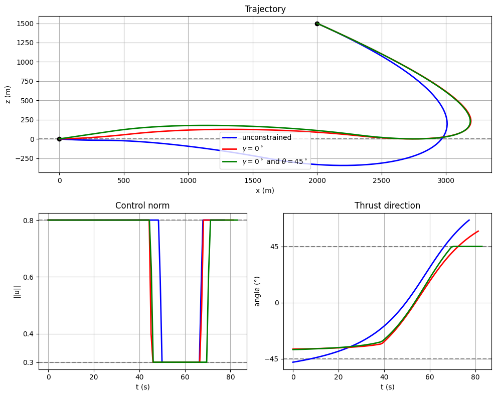

# optimal_planetary_landing_with_constraints
This is the Python CasADi implementation code for the article titled "Optimal planetary landing with pointing and glide-slope constraints".

# Optimal Control for Constrained Planetary Landing 🚀

This repository contains the numerical implementation and theoretical analysis of a vertical powered descent problem for planetary landing. The project models the optimal trajectory of a lander while strictly adhering to **glide-slope (state) constraints** and **thrust pointing (input) constraints**. 

The continuous optimal control problem is discretized and solved using Python and **CasADi/IPOPT**. The implementation numerically verifies the theoretical derivations from the source paper, successfully reproducing the "Max-Min-Max" (Bang-Bang) optimal control structure.

## 📄 Reference Article

This project is based on the theoretical framework and proofs established in the following research paper:

> **Title:** [Optimal planetary landing with pointing and glide-slope constraints]  
> **Authors:** [Clara Leparoux,  Bruno Hérissé, Frédéric Jean]  
> **Link:** [Read the full article here](https://ieeexplore.ieee.org/document/9992735/) 

## 📊 Simulation Results

The numerical optimization confirms the mathematical proofs. The solver successfully finds a trajectory that strictly respects the physical boundaries (the $5^\circ$ glide-slope cone and $45^\circ$ pointing limits) while maximizing remaining propellant. 

*Figure: The simulated optimal trajectory (x vs. z), the bang-bang control norm profile (Max-Min-Max), and the saturated thrust pointing direction.*

## 🛠️ Dependency
* **CasADi** (Nonlinear Optimization Framework)
* **IPOPT** (Interior Point Optimizer)
* **Matplotlib** (Visualization)
